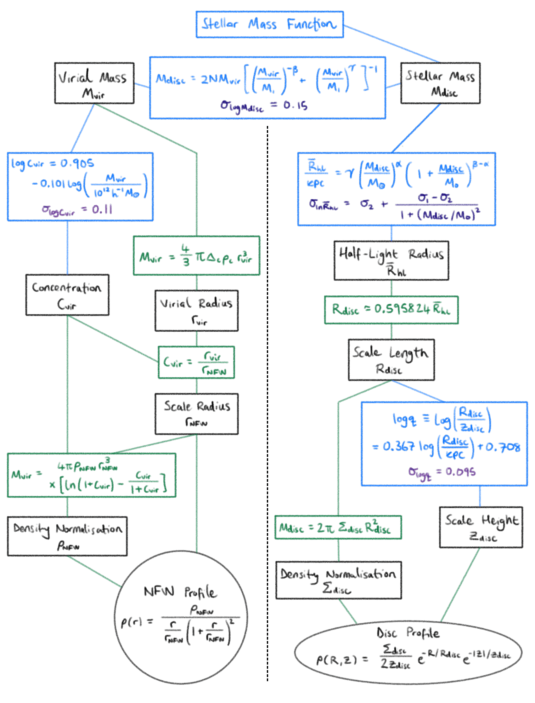
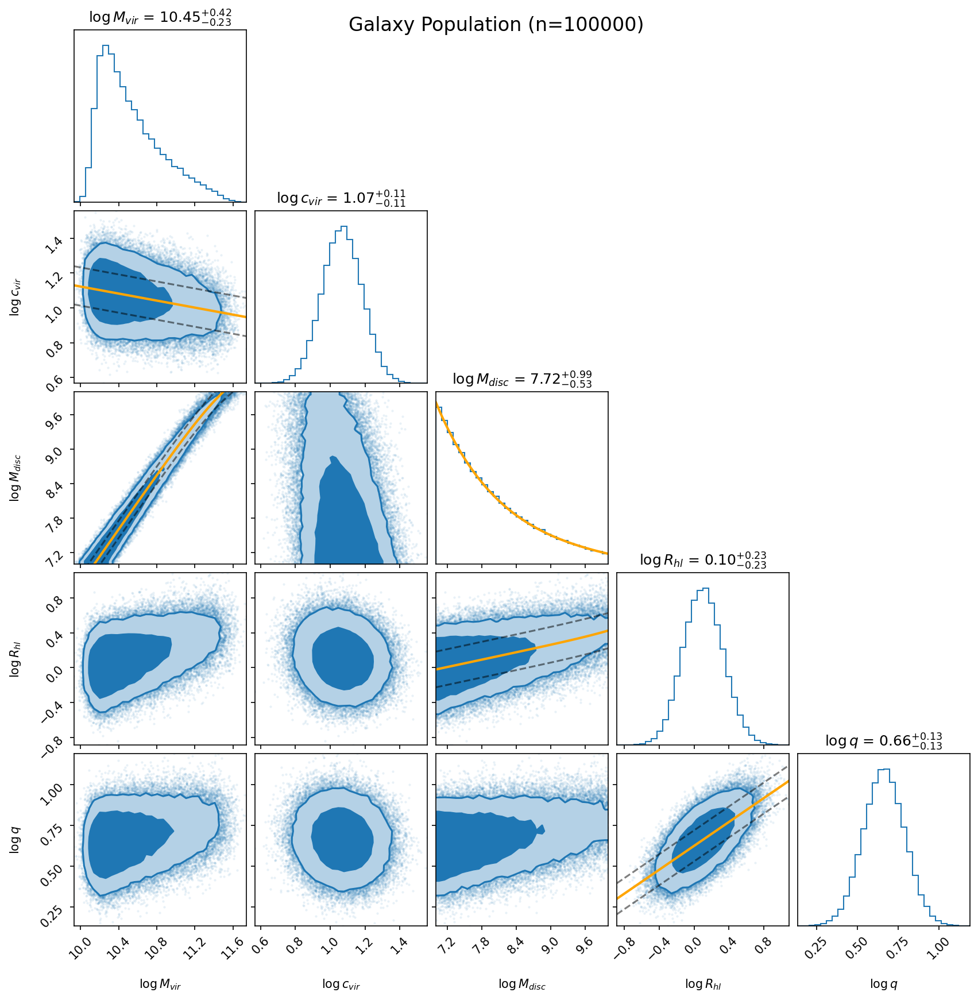

# Galaxy Sampler

[](https://arxiv.org/abs/2310.19955)
[](https://doi.org/10.1088/1475-7516/2024/04/004)
[](https://opensource.org/licenses/MIT)

**A forward-modeling pipeline to generate statistically relevant mock galaxy populations, with fully described density profiles.**

This project was built as a research tool to be used throughout my PhD. Now I am sharing it as an open-source resource for the community, with the hope that it can be useful for a variety of applications beyond my original scope.

## Table of Contents
- [Overview](#overview)
- [Implementation Details](#implementation-details)
- [Physics](#physics)
  - [Empirical Relations](#empirical-relations)
  - [Cosmological Model](#cosmological-model)
- [Statistical and Numerical Methods](#statistical-and-numerical-methods)
- [Repository Structure](#repository-structure)
- [Installation](#installation)
- [Programmatic Usage (Showcase)](#programmatic-usage-showcase)
  - [Minimal Example](#minimal-example)
  - [Data Visualisation](#data-visualisation)
  - [Data Access and Filtering](#data-access-and-filtering)
  - [Full Working Example](#full-working-example)
- [Conventions](#conventions)
- [Assumptions and Limitations](#assumptions-and-limitations)
- [Citation](#citation)
- [Bibliography](#bibliography)
- [License](#license)

## Overview

Our goal within this work is to generate a large population of mock galaxies, consisting of a double-exponential (baryonic) stellar disc component and a spherical NFW (dark matter) halo component, with parameters drawn from empirically motivated distributions and scaling relations. 

In order to relate each galactic parameter to one another we create a pipeline consisting of a series of relations, both empirical and analytic. The best way to visualise this pipeline is via the pictorial flowchart, shown below. The flow chart shows galactic parameters in black, geometric relations in green, and empirical relations in blue with their respective scatters in purple: 



This pipeline allows us to generate a large population of mock galaxies from a single observable input distribution, the stellar mass function. In practice this could easily be replaced with a different input distribution, such as a halo mass function, luminosity function, or even an observational galaxy catalogue (which typically are "incomplete" in that they only contain observed luminosity and/or a mass estimate --- not the density parameters we use to describe the physical extent of the galaxy). 

## Implementation Details

The implementation is designed to be modular and flexible, with a clear separation between the physics (empirical relations) and the numerical/statistical methods (sampling, inversion, scatter). The core pipeline is encapsulated in a `GalaxyPipeline` class that orchestrates the generation process, while the physics and numerics are implemented as stateless functions and classes that can be easily swapped out or extended.

At a high level, the default generation process consists of the following steps:

1. Sample stellar mass $M_{\rm disc}$ from an SMF.
2. Infer halo virial mass $M_{\rm vir}$ using a numerically inverted Stellar-Halo Mass Relation (SHMR).
3. Build stellar disc parameters: $R_{\rm hl}$, $R_{\rm disc}$, $q$, $z_{\rm disc}$, $\Sigma_{\rm disc}$.
4. Build halo parameters: $c_{\rm vir}$, $r_{\rm vir}$, $r_{\rm nfw}$, $\rho_{\rm nfw}$.
5. Return a unified `GalaxyPopulation` object for filtering, analysis, and plotting.

The implementation is fully vectorised and designed to be fast for Monte Carlo-style studies. Typical runs can generate on the order of $10^6$ galaxies in roughly one second.

It is also entirely possible to perform a section of the pipeline, for example to generate a population of halo parameters from an input distribution of halo masses, or to generate disc parameters from an input distribution of disc masses. 

By default, the pipeline injects intrinsic scatter into each empirical relation, which is important for generating a realistic population and for propagating uncertainties through the pipeline. However, this can be turned off if desired to return a "maximally-typical" galaxy population, which adopts the mean values of the empirical relations.

## Physics 

### Empirical Relations 

The full set of physical relations is contained within the `relations.py` module, split between  `MassRelations`, `StellarDiscRelations`, and `HaloRelations` classes. Each relation is implemented as a stateless function that takes the relevant input parameters and returns the output parameters, with optional intrinsic scatter. For the full end-to-end parameter dependency map and equation flow, see [galactic_pipeline_flowchart.pdf](galactic_pipeline_flowchart.pdf).

The core physics of the pipeline is encapsulated in a series of empirical relations that connect the various parameters of the disc and halo components. These empirical relations act to reduce the number of free parameters and ensure that the generated population is physically plausible and consistent with observed galaxy scaling relations. In particular the pipeline provides the option (through the `scatter` flag) to inject intrinsic scatter into each relation, which is important for generating a realistic population and for propagating uncertainties through the pipeline. The core relations are as follows:


1. SHMR (Moster et al. 2013):

$$
M_{\rm disc} = 2 N M_{\rm vir}\left[\left(\frac{M_{\rm vir}}{M_1}\right)^{-\beta} + \left(\frac{M_{\rm vir}}{M_1}\right)^{\gamma}\right]^{-1}
$$

1. Concentration-mass relation (Dutton and Maccio 2014):

$$
\log_{10} c_{\rm vir} = a + b\log_{10}\left(\frac{M_{\rm vir}}{10^{12} h^{-1} M_\odot}\right)
$$

3. Disc size-mass relation (Shen et al. 2003):

$$
R_{\rm hl} = \gamma M_{\rm disc}^{\alpha}\left(1 + \frac{M_{\rm disc}}{M_0}\right)^{\beta - \alpha}
$$


4. Disc oblateness (Bershady et al. 2010):

$$
\log_{10} q \equiv \log_{10}\left(\frac{R_{\rm disc}}{z_{\rm disc}}\right) = a + b \log_{10}\left(R_{\rm disc} / {\rm kpc}\right) 
$$

With values for the fitting parameters and intrinsic scatters taken from the original papers (full citation list in the bibliography section below). 

Alongside these empirical relations, the pipeline also includes the option to inject a custom stellar mass function (SMF) as the initial sampling distribution. By default, the pipeline uses a single Schechter function in log-space, with fitting parameters taken from Kelvin et al. (2014), but it also includes built-in options for a double Schechter and a bounded log-normal, as well as the ability for users to define their own custom PDF.

A full writeup of the physics and empirical relations is available in the appendix of our original paper (Burrage, March, and Naik 2024, JCAP, 04, 004), which introduced this pipeline as a tool for computing the screening of scalar fifth forces in galaxies.

### Cosmological Model

The codebase includes a simple cosmology module (`cosmology.py`) that defines an immutable `Cosmology` dataclass with parameters $h$, $\Omega_m$, and $\Delta_{\rm vir}$. The cosmology is used to compute the critical density $\rho_{\rm crit}$, which is needed for computing halo parameters. By default, the pipeline uses a basic cosmology of $h=0.7$, $\Omega_m=0.3$, and $\Delta_{\rm vir}=200$, but users can easily inject their own cosmological parameters if desired.

## Statistical and Numerical Methods

Alongside the astrophysical relations, the pipeline uses standard numerical and statistical methods to perform the sampling, inversion, and scatter injection. The core methods include:

1. Inverse-transform sampling (`numerics.sample_from_pdf`) for drawing stellar masses from arbitrary user-defined PDFs.
2. Interpolative inversion (`numerics.NumericalInverter`) for numerically stable reverse mapping of the SHMR.
3. Intrinsic scatter modeled as log-normal perturbations in physically positive quantities.
4. Local slope-based propagation of reverse scatter in the SHMR inversion.
5. Vectorised NumPy array operations throughout for high-throughput generation.


## Repository Structure

- `structures.py`: Typed containers (`StellarDiscParams`, `NFWHaloParams`, `GalaxyPopulation`) with `.log` and `.filter(...)` methods.
- `cosmology.py`: Immutable cosmology dataclass to store relevant cosmological parameters.
- `numerics.py`: Inverse-transform sampling and interpolation-based inversion tools.
- `relations.py`: Stateless geometric and empirical relations, as well as stellar mass function PDFs.
- `pipeline.py`: `GalaxyPipeline` orchestration layer, tying the relations together into the working pipeline.
- `plotting.py`: Corner plotting utilities to show the sampled galactic parameters with mean-relation overlays.


## Installation

All dependencies are listed in `environment.yml`, which can be used to set up a Conda environment with the following command:

```bash
conda env create -f environment.yml
conda activate galaxy-sampler-dev
```

## Programmatic Usage (Showcase)

Each module contains a built-in showcase that demonstrates the core functionality and usage of the module. Nonetheless, we will provide a quick overview of the core features here in the README for easy reference.

### Minimal Example

```python
from pipeline import GalaxyPipeline

pipeline = GalaxyPipeline()
population = pipeline.generate_population(n_samples=100_000, scatter=True)
```

With this simple code snippet, the default pipeline will generate a population of mock galaxies and store them in a `GalaxyPopulation` object, which contains the disc and halo parameters as typed containers. 

### Data Visualisation

We provide an easy-to-use corner plotting utility to visualise the generated population and the underlying relations:

```python
from plotting import plot_population_corner

plot_population_corner(
	 population,
	 bins=30,
	 title=f"Galaxy Population (n={population.size})",
	 filename=f"example_corner_plot.png"
)
```

This code produces (and saves) the following corner plot, showing the distribution of the generated parameters, with 1 and 2 sigma contours, as well as the mean relations overplotted in orange, with $\pm$ 1 and 2 sigma scatter bounds in dashed grey lines:



### Data Access and Filtering

This `GalaxyPopulation` object is used for convenient storage/access and filtering, for example:

```python

# Access the disc and halo masses:
disc_masses = population.disc.mass
halo_masses = population.halo.mass

# Filter the population to only include galaxies with halo masses above 10^11 M_sun:
mask = population.halo.mass >= 1e11
filtered_population = population.filter(mask)
# Now the `GalaxyPopulation` object `filtered_population` only contains the 
# galaxies that satisfy the mask, and we can access their parameters as before:
filtered_disc_masses = filtered_population.disc.mass

# The `GalaxyPopulation` object also has a `.log` accessor that allows us to 
# conveniently access the parameters in log-space, e.g.:
log_halo_masses = population.halo.log.mass
log_concentrations = population.halo.log.concentration
```

### Full Working Example

A more complete example of the options available in the pipeline is shown in the next section, which demonstrates how to generate a population with a custom cosmology, SMF and stellar mass domain:

```python
import numpy as np
from cosmology import Cosmology
from pipeline import GalaxyPipeline

# Set random seed for reproducibility
np.random.seed(42)

# Override cosmology
planck_cosmo = Cosmology(h=0.674, omega_m=0.313, delta_vir=200.0)

# Create a custom SMF
def custom_pdf(log_M_disc, **kwargs):
	...
	return probability_density_values

# Custom SMF parameters (if needed)
smf_kwargs = {...}

# Set the stellar mass domain for sampling from the SMF
stellar_mass_min = 1e9  # Minimum stellar mass (in M_sun)
stellar_mass_max = 1e11  # Maximum stellar mass (in M_sun)

# Initialise the pipeline with the custom cosmology
pipeline = GalaxyPipeline(cosmo=planck_cosmo)

# Generate a population with the custom SMF and scatter
population = pipeline.generate_population(
	n_samples=100_000,
	scatter=True,
	stellar_mass_min=stellar_mass_min,
	stellar_mass_max=stellar_mass_max, 
	smf_pdf=custom_pdf,
	**smf_kwargs
)
```

## Conventions

- Units:
  - Masses in $M_\odot$
  - Radii in kpc
  - Surface density in $M_\odot / \mathrm{kpc}^2$
  - Volume density in $M_\odot / \mathrm{kpc}^3$
- Naming convention:
  - Disc-centric radii use uppercase $R$ (cylindrical)
  - Halo-centric radii use lowercase $r$ (spherical)
  - NFW halo mass reported is virial mass ($M_{200c}$), not total divergent NFW mass.


## Assumptions and Limitations

1. Empirical relations are calibrated primarily for local-universe populations and may not be valid outside their fitted mass/redshift regimes. Similarly default relation parameters are fixed-form and do not include explicit redshift evolution.
2. Numerical inversion assumes monotonicity over configured inversion bounds (valid for the default SHMR used).
3. Physical realism depends on chosen SMF and relation/scatter hyperparameters.

## Citation

If you use this pipeline in academic work, please cite [our original paper](https://doi.org/10.1088/1475-7516/2024/04/004) that introduced it.

```bibtex
@ARTICLE{2024JCAP...04..004B,
       author = {{Burrage}, Clare and {March}, Bradley and {Naik}, Aneesh P.},
        title = "{Accurate computation of the screening of scalar fifth forces in galaxies}",
      journal = {\jcap},
     keywords = {dark energy theory, galaxy surveys, modified gravity, Astrophysics - Cosmology and Nongalactic Astrophysics, Astrophysics - Astrophysics of Galaxies, General Relativity and Quantum Cosmology},
         year = 2024,
        month = apr,
       volume = {2024},
       number = {4},
          eid = {004},
        pages = {004},
          doi = {10.1088/1475-7516/2024/04/004},
archivePrefix = {arXiv},
       eprint = {2310.19955},
 primaryClass = {astro-ph.CO},
       adsurl = {https://ui.adsabs.harvard.edu/abs/2024JCAP...04..004B},
      adsnote = {Provided by the SAO/NASA Astrophysics Data System}
}
```

## Bibliography

1. [Moster, B. P., Naab, T., and White, S. D. M. (2013), MNRAS, 428, 3121.](https://doi.org/10.1093/mnras/sts261)
2. [Dutton, A. A., and Maccio, A. V. (2014), MNRAS, 441, 3359.](https://doi.org/10.1093/mnras/stu742)
3. [Shen, S., et al. (2003), MNRAS, 343, 978.](https://doi.org/10.1046/j.1365-8711.2003.06740.x)
4. [Bershady, M. A., et al. (2010), ApJ, 716, 234.](https://doi.org/10.1088/0004-637X/716/1/234)
5. [Kelvin, L. S., et al. (2014), MNRAS, 444, 1647.](https://doi.org/10.1093/mnras/stu1507)

## License

See [LICENSE.txt](LICENSE.txt).
